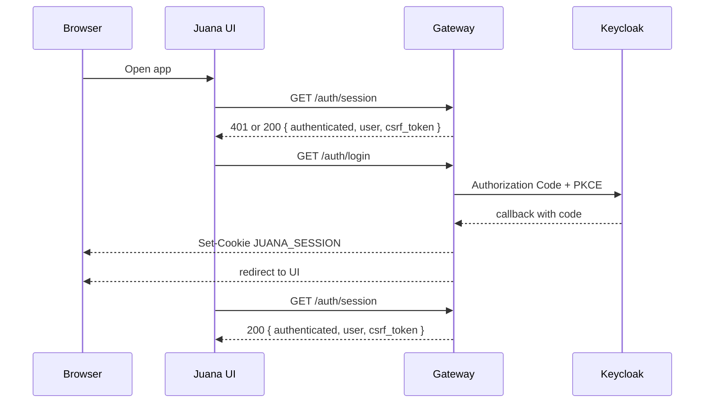

# Authentication and Session Flow

## Overview

Juana UI uses a Backend for Frontend (BFF) model. The browser never stores or manages OAuth tokens directly. Authentication state is represented by the `JUANA_SESSION` cookie issued by `gateway-server`.

## Verified current flow



## Public auth endpoints

| Method | Route | Purpose |
|---|---|---|
| `GET` | `/auth/login` | Start browser login |
| `GET` | `/auth/callback` | Receive OIDC callback |
| `GET` | `/auth/session` | Bootstrap current browser session |
| `GET` | `/auth/logout` | Clear browser-authenticated session |

## Session bootstrap

The frontend starts by calling `GET /auth/session`.

### Response shape

```json
{
  "authenticated": true,
  "user": {
    "user_id": "136be623-e055-4676-bb43-cdebb76efc78",
    "roles": ["JUANA_ADMIN"],
    "capabilities": []
  },
  "csrf_token": "..."
}
```

### Client behavior

- If `authenticated` is `true`, the UI stores `user` and `csrf_token` in the auth slice.
- If the session is missing or invalid, the UI remains unauthenticated and can initiate `/auth/login`.

## Cookie model

The browser session is represented by `JUANA_SESSION`.

### Important properties

- `HttpOnly`
- `Secure`
- `SameSite=Lax`

The cookie is managed by Gateway, not by frontend code.

## CSRF model

Gateway requires `X-CSRF-Token` for browser-authenticated mutations and for `GET /auth/logout`.

### Current UI behavior

The shared `createGatewayBaseQuery()`:

- sends `credentials: 'include'`
- reads `csrf_token` from Redux memory
- injects `X-CSRF-Token` for:
  - `POST`
  - `PUT`
  - `PATCH`
  - `DELETE`
  - `GET /auth/logout`

This is a verified current behavior in the frontend codebase.

## Logout flow

The current logout flow is:

1. UI calls `GET /auth/logout` with `X-CSRF-Token`
2. Gateway invalidates the server-side session
3. Gateway clears `JUANA_SESSION`
4. The frontend clears local auth state
5. The user returns to `/login`

## What this document does not assume

This document does not assume:

- browser-managed JWT storage
- direct calls from the browser to internal microservices
- alternate auth providers beyond the current Keycloak-backed Gateway flow
