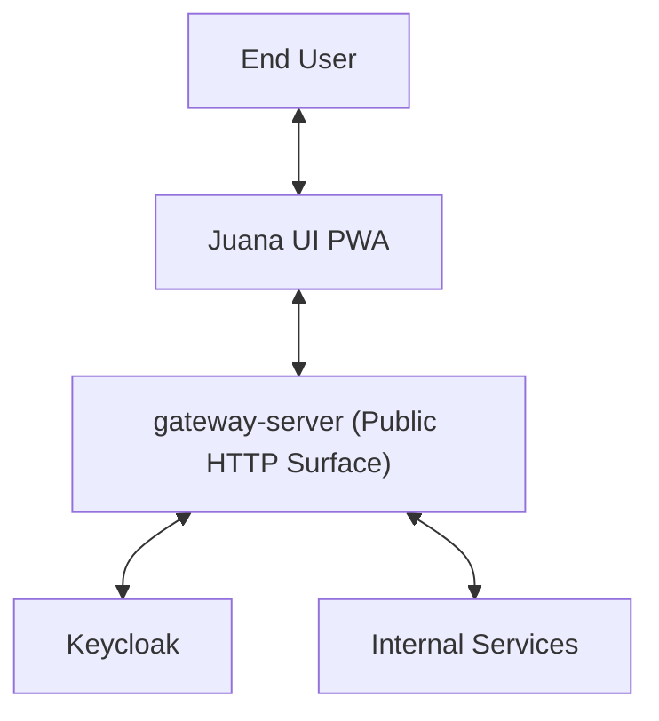
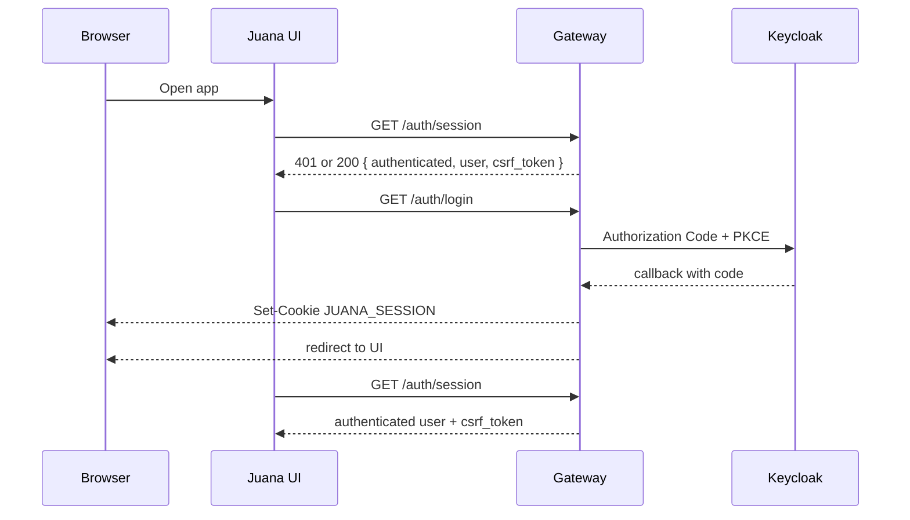

# Software Design Document - Juana UI PWA

**Version:** 1.1  
**Status:** Draft / Actionable  
**Last Updated:** 2026-04-10  
**Project:** Juana IA v2 - Frontend

## 1. Purpose and Scope

This document defines the current architecture and near-term target state of `juana-pwd-ui`, the React + TypeScript PWA for Juana.

The UI consumes only the public surface exposed by `gateway-server`. It does not call internal Python or Java services directly and it does not manage OAuth tokens in browser code.

This SDD focuses on:

- the current frontend structure
- the BFF authentication and session model
- the public API integration model
- the current testing and mocking strategy
- the gaps between the current repo state and the intended product surface

## 2. System Context

### Architectural boundary

- The browser talks only to `gateway-server`.
- `gateway-server` is responsible for authentication, browser session management, CSRF enforcement, and identity propagation to downstream services.
- The UI is not part of the internal service network and must treat backend contracts as public only when they are documented in the Juana API public contract.

## 3. Functional and Non-Functional Drivers

### Functional drivers

- Support browser-based login through the Gateway BFF.
- Bootstrap the authenticated user session from `GET /auth/session`.
- Provide a shell experience for chat, knowledge, memory, settings, and admin navigation.
- Integrate progressively with Juana public endpoints without bypassing Gateway.

### Non-functional drivers

- No OAuth access tokens or refresh tokens in browser-managed state.
- Session authentication via secure cookie.
- CSRF protection for browser-authenticated mutations and logout.
- Fast local iteration via Vite and MSW.
- Type-safe API integration via RTK Query.
- Progressive enhancement toward a real PWA experience.

## 4. Current Frontend Architecture

The repo follows a feature-oriented structure under `src/features`.

### Current implemented modules

| Module | Current State | Notes |
|---|---|---|
| `auth` | Implemented | Login page, callback page, Redux auth slice, RTK Query auth API |
| `chat` | Partially implemented | Placeholder chat page plus starred-message RTK Query integration |
| `shell` | Implemented | Main layout, navigation, current user card, logout action |
| `knowledge` | Placeholder | Route/module exists but no public API integration yet |
| `memory` | Placeholder | Route/module exists but no public API integration yet |
| `profile` | Placeholder | Route/module exists but no implemented API contract yet |
| `settings` | Placeholder | Route/module exists |
| `admin` | Placeholder | Route/module exists |
| `home` | Placeholder/supporting | Current shell landing composition |

### Store composition

The current Redux store includes:

- `auth` slice
- `chat` slice
- `authApi` RTK Query service
- `chatApi` RTK Query service

This is the currently implemented state. Additional feature stores are not yet wired.

## 5. Routing Strategy

Current route constants are defined in [routes.ts](/D:/projects/react/juana-pwd-ui/src/router/routes.ts).

| Route | Purpose | Current State |
|---|---|---|
| `/login` | Login entry | Implemented |
| `/auth/callback` | BFF callback landing page | Implemented |
| `/` | Chat workspace shell | Implemented |
| `/knowledge` | Knowledge area | Placeholder |
| `/memory` | Memory area | Placeholder |
| `/profile` | Profile area | Placeholder |
| `/notifications` | Notifications area | Route constant only |
| `/settings` | Settings area | Placeholder |
| `/admin` | Admin area | Placeholder |
| `/tasks` | Tasks area | Route constant only |
| `/connectors` | Connectors area | Route constant only |
| `/dashboard` | Dashboard area | Route constant only |

### Route guards and dependencies

| Route | Auth Requirement | Data Dependency |
|---|---|---|
| `/login` | Public | none |
| `/auth/callback` | Public callback entry | `GET /auth/session` |
| `/` | Authenticated shell | `GET /auth/session` bootstrap |
| Shell children | Authenticated shell | session in Redux, feature-specific APIs as implemented |

## 6. State Management Strategy

### Current state model

- **Redux slices** manage frontend session state and local chat UI state.
- **RTK Query** manages API request state, caching, loading, and invalidation.
- **Auth bootstrap** stores `user` and `csrf_token` in the `auth` slice after `GET /auth/session`.

### Current auth state fields

The `auth` slice currently stores:

- `isAuthenticated`
- `user`
- `csrfToken`
- `isLoading`

This matches the implemented browser-session model and is the canonical current state.

## 7. API Integration Model

The UI currently talks to Gateway through Vite proxying in development and through the same public surface in runtime.

### Public endpoints currently verified

| Feature | Method | Route | Status |
|---|---|---|---|
| Auth login | `GET` | `/auth/login` | Verified |
| Auth callback | `GET` | `/auth/callback` | Verified |
| Auth session | `GET` | `/auth/session` | Verified |
| Auth logout | `GET` | `/auth/logout` | Verified |
| Soul chat | `POST` | `/api/v1/soul/chat` | Public contract exists; frontend integration pending |
| Knowledge text upload | `POST` | `/api/v1/knowledge/documents/text` | Public contract exists; frontend integration pending |
| Knowledge file upload | `POST` | `/api/v1/knowledge/documents/files` | Public contract exists; frontend integration pending |
| Knowledge job status | `GET` | `/api/v1/knowledge/jobs/{job_id}` | Public contract exists; frontend integration pending |

### Current RTK Query services

| Service | Base Path | Current Responsibility |
|---|---|---|
| `authApi` | `/auth` | Session bootstrap and logout |
| `chatApi` | `/api/v1` | Starred-message routes present in frontend code |

### Important distinction

The presence of a route in frontend code does not automatically make it part of the validated public API contract.

At the time of writing:

- `authApi` is aligned with the real public Gateway surface.
- `chatApi` currently contains starred-message routes that are implemented in frontend code but are not yet part of the validated public contract used for this UI effort.

Those routes must be treated as **gap / target-state integration**, not as established public API.

## 8. BFF Authentication and Session Flow

The UI uses the Gateway BFF session model.

### Key properties

- The browser does not store raw OAuth tokens.
- `JUANA_SESSION` is the browser session cookie.
- `GET /auth/session` is the bootstrap endpoint for identity and CSRF state.
- The UI uses `credentials: 'include'`.

## 9. CSRF Model

The current frontend implementation uses a shared `gatewayBaseQuery`.

### Current enforced behavior

- `csrf_token` is returned by `GET /auth/session`.
- The token is kept in Redux memory.
- `X-CSRF-Token` is attached automatically for:
  - state-changing methods
  - `GET /auth/logout`

This matches the current Gateway hardening.

## 10. Error, Loading, and Empty State Strategy

### Current state

- Auth bootstrap is represented through `isLoading` in the auth slice.
- Auth callback resolves by reloading session state through `useGetSessionQuery()`.
- RTK Query exposes request status per endpoint.
- Placeholder modules currently show shell-level placeholder content rather than complete empty-state flows.

### Near-term target

- Standardize loading, error, and empty states across shell modules.
- Add predictable UX for expired sessions, upload failures, and unavailable backend features.

## 11. Mocking Strategy

MSW is used for local development and tests.

### Current behavior

- With `VITE_DEV_AUTH_ENABLED=true`, auth can be bootstrapped through local mock behavior.
- With `VITE_DEV_AUTH_ENABLED=false`, `/auth` and `/api/v1` requests pass through to the real Gateway.

This is important: the repo already supports real BFF integration locally and does not depend exclusively on mocks.

## 12. Testing Strategy

### Current testing layers

- **Unit / integration:** Vitest
- **Frontend state tests:** slice and API utility coverage
- **E2E:** Playwright

### Current verified E2E coverage

The repo now has a real Playwright smoke flow for:

- login through Keycloak
- callback and session bootstrap
- authenticated shell load
- logout through Gateway with CSRF

This is the currently verified scope. Chat and knowledge E2E flows are not implemented yet.

## 13. Runtime and Deployment Assumptions

### Local development

- Vite runs on `http://localhost:5173`
- `/auth` and `/api/v1` are proxied to `http://localhost:8072`
- local Keycloak participates in the browser login flow

### Security assumptions

- browser session cookie is managed by Gateway
- allowed origins must be configured in Gateway
- redirect URIs must be configured in Keycloak for the UI host

## 14. Gaps and Open Issues

1. `chatApi` contains starred-message endpoints that are not yet part of the validated public API contract for this UI effort.
2. The public contract for real chat UX is still thinner than the intended product experience; the frontend shell exists before the full chat integration exists.
3. Knowledge, memory, profile, settings, and admin modules are structurally present but not yet implemented against final public APIs.
4. Several route constants exist (`notifications`, `tasks`, `connectors`, `dashboard`) without implemented screens or documented public integration.
5. The frontend still needs its own glossary document so UI-specific terminology is governed locally while staying aligned with Juana backend canonical names.

## 15. Current State vs Target State

### Current state

- BFF auth is real and working.
- Session bootstrap is real and working.
- CSRF handling is real and wired in code.
- Shell navigation exists.
- Auth and starred-message API clients exist.
- Most product modules are still placeholder-level.

### Target state

- real chat flows integrated against validated public contracts
- real knowledge upload and job status flows
- documented route-level data dependencies for each user-facing module
- UI glossary aligned with Juana platform terminology

## 16. Recommended Next Steps

1. Add a UI glossary with canonical frontend-facing terms aligned with Juana backend naming.
2. Implement `knowledgeApi` against the already validated public knowledge endpoints.
3. Decide whether starred-message routes are part of the official public contract or should be removed from the current frontend integration.
4. Replace placeholder route modules with feature-specific state, data, loading, and error handling.
5. Expand Playwright beyond auth to cover at least one real business flow after the corresponding public endpoint integration lands.
